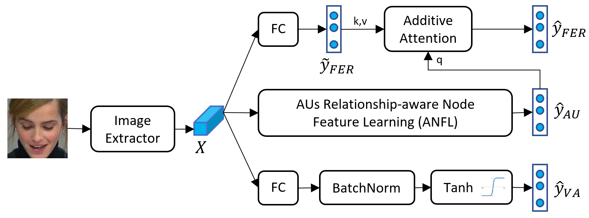

# Multi-task Learning Challenge of The ABAW 4th Competition

This is the source code of our proposed method [Multi-task Cross Attention Network in Facial Behavior Analysis](https://arxiv.org/abs/2207.10293)

We (CNU_Sclab Team) paticipated in [ABAW 4th MTL Challenge](https://ibug.doc.ic.ac.uk/resources/eccv-2023-4th-abaw/).

We borrowed the [SAM optimizer](https://github.com/davda54/sam) source code for Pytorch and refered to the ANFL of [this paper](https://arxiv.org/abs/2205.01782)

In addition, we used pre-train EfficientNet B0 on  Facial Behavior Tasks of Savchenko in [this project](https://github.com/HSE-asavchenko/face-emotion-recognition)

# Dependency

Our packages are in the `requirements.txt`. In particular, to use EfficientNet of Savchenko, we must use the exact version of timm:
```
pip install timm==0.4.5
```

# Model Architecture




# Pretrained Model

The pretrained model can be downloaded from this [link](https://ejnu-my.sharepoint.com/:u:/g/personal/nguyendangkhanh_jnu_ac_kr/EcdgOgEt1lxDj0wxrnsmVmwBYaH86WfNKBL6Zn_DWY7knQ?e=UHiVoY).

s-Aff-Wild2 extracted feature: [no augmented](https://ejnu-my.sharepoint.com/:u:/g/personal/nguyendangkhanh_jnu_ac_kr/Ea1D2zMMhQRIkSfA1KGYUogBpt4VWBwvZC7L2cYvFpeBvA?e=d5VrtV) and [augmented](https://ejnu-my.sharepoint.com/:u:/g/personal/nguyendangkhanh_jnu_ac_kr/EabgoTcAN_hPs9-8Efd1VB4BbKyoqWQX0IK5TivpASfq7A?e=dAVJVd)

This model was trained on the training set of the Aff-wild2 dataset, and evaluated on the validation set of the Aff-wild2 dataset.

The validation metrics are listed below:

| PAU | PEX | PVA | PMTL|
| --- | ---| ---| ---|
| 0.43| 0.33| 0.49| 1.25|
